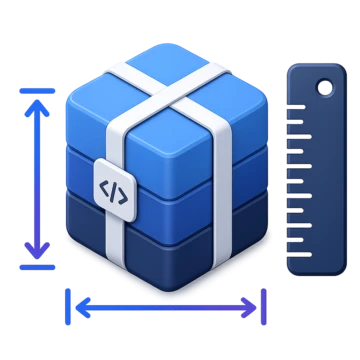

<p align="center">
  
</p>

<h1 align="center">
  bundle-size
</h1>

<div align="center">

[](https://github.com/semantic-release/semantic-release)

</div>

Records your package's bundle size in a `package.json` field at release time, so
a [shields.io](https://shields.io) badge can read it back from the npm registry.

## Why

Bundlephobia-backed badges often fail with `rate limited by upstream service`:
shields.io fetches the size from bundlephobia, and that upstream throttles
shields.io's aggregate traffic. Nothing you can configure on your side fixes
that, because the limit isn't yours to raise.

The npm registry doesn't throttle it: it's a high-volume CDN that serves static
JSON, absorbs shields.io's volume without noticing, and already backs the
`npm/v` and `npm/l` badges that never break. It also preserves arbitrary
`package.json` fields, and shields.io can query them.

So: write the number into the manifest at publish time, and read it back from
the registry.

## Usage

Add a step to your release workflow, after the build and before publishing:

```yaml
- name: Record bundle size
  uses: igordanchenko/actions/bundle-size@v1
```

Then add the badge to your README:

```markdown
[](https://bundlephobia.com/package/<package>)
```

## Requirements

The action runs [`size-limit`](https://github.com/ai/size-limit), reads its
`--json` output, and writes the chosen entry's size into `package.json`. So the
package needs `size-limit` installed and configured, and `actions/setup-node`
run first.

The action doesn't measure anything itself — `size-limit` owns that. What counts
as "the bundle" is per-package config (entry point, which peer dependencies to
`ignore`), and keeping it in your `size-limit` config means the number your CI
checks and the number in the badge can't drift apart:

```json
[
  {
    "path": "dist/index.js",
    "ignore": ["react", "react-dom", "react/jsx-runtime"]
  }
]
```

The `entry` input selects which entry to record by its `path`, so a multi-entry
config (e.g. a separate `CSS` entry) can measure everything while the badge
advertises just one. If an entry sets an explicit `name`, match on that instead.

The action records whatever `size-limit` measures — it doesn't impose a
compression mode. `size-limit` defaults to brotli, which reflects what a browser
downloads from a modern CDN; set `gzip: true` in your config to switch (or
disable both to measure uncompressed).

## Inputs

| Input               | Default         | Description                                                 |
| ------------------- | --------------- | ----------------------------------------------------------- |
| `entry`             | `dist/index.js` | `size-limit` entry to record — its `path`, or `name` if set |
| `field`             | `bundleSize`    | `package.json` field to write the size to                   |
| `working-directory` | `.`             | Directory containing the package to measure                 |

## Outputs

| Output  | Description                              |
| ------- | ---------------------------------------- |
| `bytes` | Measured size in bytes                   |
| `size`  | Formatted size written to `package.json` |

## Notes

The field belongs only in the manifest that gets published — don't commit it
back to your repository, or it will go stale. If you use `semantic-release`,
place this step alongside your other publish-time manifest edits.

The registry serves `max-age=300` and shields.io caches for a further 120s, so
the badge picks up a new release within a few minutes. Nothing to purge.

The action fails if your size-limit budget is exceeded: when an entry sets a
`limit` and the measured size is over it, `size-limit` exits non-zero and the
step fails before anything is written — an oversized bundle stops the release
instead of being recorded.

Sizes are formatted with an adaptive unit (decimal, base-1000) and 3 significant
digits: exact bytes below 1 kB, then `kB`, then `MB` — e.g. `747 B`, `1.07 kB`,
`10.7 kB`, `748 kB`, `1.24 MB`.

## License

MIT © 2026 [Igor Danchenko](https://github.com/igordanchenko)
